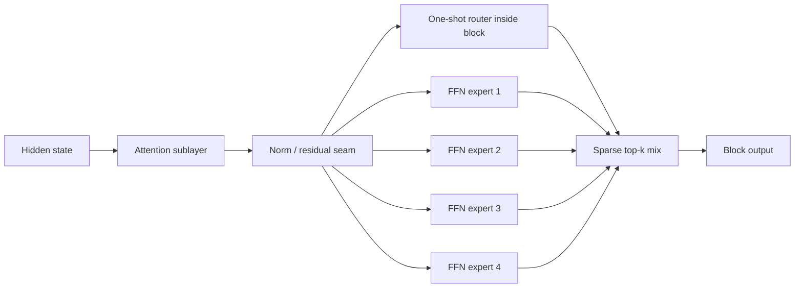
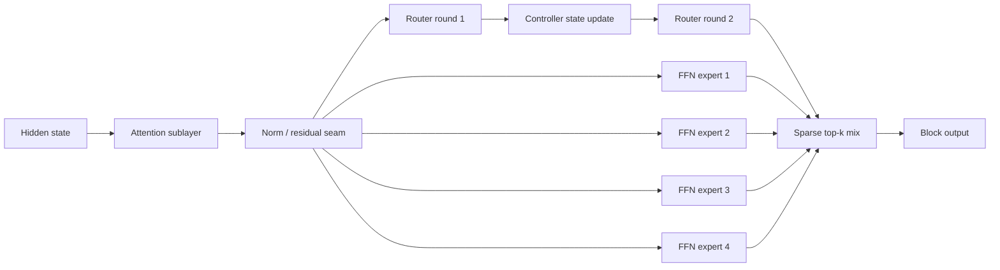

# DREEGMOR Mini-MoE Design

## Status

Proposed design contract.

This document replaces the current one-block scale-proxy shape as the intended main comparison line. The old whole-backbone DREEGMOR and one-block scale-proxy surfaces remain useful controls, but they are not structurally faithful enough to serve as the primary miniature for scaled MoE comparisons.

## Goal

Build a miniature that is structurally homologous to a scaled sparse MoE model, so that:

- the reference miniature and our miniature differ in as few axes as possible
- routing/control changes can be attributed cleanly
- scaling comparisons are honest enough to matter

## Pressure Test

### Primary-source findings

- [Switch Transformers (2021; revised June 16, 2022)](https://arxiv.org/abs/2101.03961)
  - Sparse MoE is defined by conditional parameter activation at roughly constant compute.
  - The router is part of the MoE layer, not an external whole-model controller.

- [ST-MoE (February 17, 2022)](https://arxiv.org/abs/2202.08906)
  - Stable large sparse models are achieved by improving the standard sparse expert recipe, not by moving routing outside the backbone.

- [Mixtral of Experts (January 8, 2024)](https://arxiv.org/abs/2401.04088)
  - The transformer architecture remains shared.
  - Each layer uses multiple feedforward experts.
  - Routing happens per token at each layer.

- [DeepSeekMoE (January 11, 2024)](https://arxiv.org/abs/2401.06066)
  - The core MoE pattern remains internal routed experts inside the model.
  - Shared experts and finer-grained expert segmentation are extensions of that internal pattern.

- [JetMoE (April 11, 2024)](https://arxiv.org/abs/2404.07413)
  - Attention-expert MoE exists, but it is a more specialized branch.
  - This is not the safest default reference architecture.

- [Nemotron 3 Nano technical report (December 23, 2025)](https://research.nvidia.com/labs/nemotron/files/NVIDIA-Nemotron-3-Nano-Technical-Report.pdf)
  - In the hybrid Mamba/attention setting, sparse MoE is introduced by replacing standard FFN layers with sparse MoE layers.
  - The model repeats MoE throughout depth rather than expertizing a single isolated layer.

### Verdict

The assumptions that survive:

- experts should live inside repeated backbone blocks
- the router should live inside those MoE blocks
- the default expert type should be FFN-style, not whole-model or whole-attention-block
- sparse activation must be part of the contract
- the reference MoE and our MoE should share the same trunk, expert placement, expert width, expert count, and active expert count

The assumptions that do not survive:

- external whole-model routing as the main design
- a `7 dense : 1 expertized` ratio as the primary miniature
- dense always-run experts as the main MoE proxy
- attention-block experts as the default reference architecture

## Design Contract

### Reference miniature

The reference miniature should be a standard sparse transformer-MoE.

Block shape:

Whole model:

```mermaid
flowchart LR
    X["Input tokens"] --> E["Embedding"]
    E --> B1["Attn + MoE-FFN 1"]
    B1 --> B2["Attn + MoE-FFN 2"]
    B2 --> B3["Attn + MoE-FFN 3"]
    B3 --> B4["Attn + MoE-FFN 4"]
    B4 --> B5["Attn + MoE-FFN 5"]
    B5 --> B6["Attn + MoE-FFN 6"]
    B6 --> B7["Attn + MoE-FFN 7"]
    B7 --> B8["Attn + MoE-FFN 8"]
    B8 --> H["LM head"]
    H --> Y["Logits"]
```

### Our miniature

Our miniature should keep the same MoE block placement and expert contract, and change only the router/control logic.

Block shape:

The only architectural delta between the two miniatures should be:

- one-shot router vs recurrent router

Everything else should remain fixed.

## Fixed Axes

These must be shared between the reference miniature and our miniature:

- same token embedding
- same LM head
- same number of transformer blocks
- same attention implementation
- same hidden width
- same FFN expert width
- same number of routed experts per MoE layer
- same top-k active experts
- same MoE layer schedule
- same optimizer, batch shape, corpus, eval procedure, and seed policy

## Initial Miniature Proposal

Phase 1 proposal:

- backbone depth: `8` blocks
- hidden width: keep the current `A` width for now
- MoE block schedule: all `8` FFN sublayers become MoE FFN sublayers
- routed experts per MoE layer: `4`
- active experts per token: `top-1`
- shared experts: none in the first implementation
- load-balance auxiliary loss: yes
- token dropping: no in phase 1

Rationale:

- `all-FFN-MoE` is a more honest default reference than a single expertized block
- `4 experts / top-1` preserves real sparsity while staying small enough to run locally
- omitting shared experts initially keeps the first comparison legible

## Explicit Non-Goals For Phase 1

- no external whole-model router
- no whole-backbone expert duplication
- no single-expertized-layer main line
- no attention-expert default reference
- no `A + M` hybrid miniature yet
- no graph prior yet
- no expert-feedback recurrent routing in the first implementation

## Role Of Existing Surfaces

- whole-backbone DREEGMOR:
  - exploratory control only
- one-block scale proxy:
  - transitional control only
- mini-MoE reference:
  - new main reference line
- mini-MoE recurrent router:
  - new main thesis line

## Acceptance Rule

We should not move to larger budgets or larger expert counts until:

- the reference mini-MoE is stable and sparse
- the recurrent mini-MoE differs only in router/control
- both variants report quality, throughput, memory, routing balance, and active-expert usage cleanly

## Implication For Implementation

The next architecture surface should not be built by wrapping the existing monolithic `TransformerEncoder` block from the outside.

It should introduce an explicit tiny block contract:

- attention sublayer
- dense FFN sublayer
- sparse MoE FFN sublayer
- recurrent-router sparse MoE FFN sublayer

That is the cleanest way to keep the miniature honest and the comparison falsifiable.
