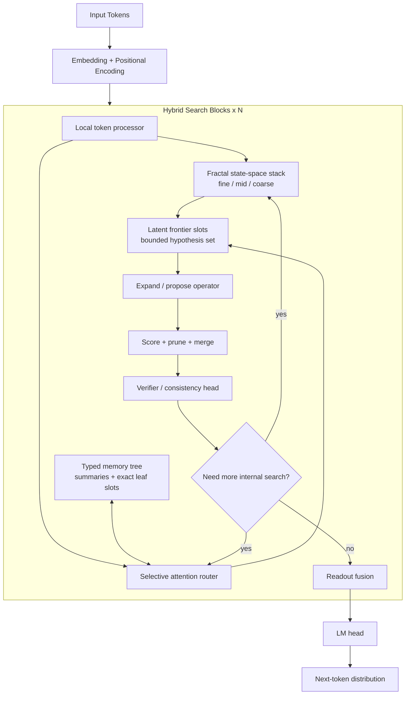

# Native Internal Search Sketch

This is a speculative architecture sketch, not an implementation commitment.

The thesis is:
- use selective attention for addressable reads and writes
- use fractal state-space layers for cheap multiscale persistent state
- keep multiple live latent hypotheses inside a bounded frontier
- score, prune, merge, and verify those hypotheses before emitting tokens

The goal is to let the model do something closer to search internally without
forcing every branch into explicit text.

## High-Level Shape

## What Each Part Is Doing

- `Fractal state-space stack`: carries compressed working state at multiple
  timescales so the model can keep coarse and fine search context alive cheaply.
- `Selective attention router`: performs sparse addressable reads when the model
  needs exact content or distant comparison.
- `Typed memory tree`: stores summaries at larger spans and exact local content
  at leaves so retrieval can move coarse-to-fine.
- `Latent frontier slots`: hold several active candidate solution states at
  once instead of collapsing immediately to one serial thought.
- `Expand / propose`: generates the next candidate updates for the frontier.
- `Score + prune + merge`: enforces competition and bounded compute.
- `Verifier / consistency head`: checks whether the current frontier is
  coherent enough to stop searching.

## Why This Could Beat Pure External GoT

- branch state stays latent instead of being serialized into text tokens
- multiscale recurrent state is cheaper than repeated full-context re-entry
- selective attention is only used when retrieval earns its cost
- halting can be local to a block instead of paying for a new harness call

## What Still Needs To Be True

- the frontier must represent distinct hypotheses, not redundant copies
- pruning must preserve diversity instead of collapsing too early
- verification must correlate with answer quality
- training has to reward useful internal branching rather than verbose drift
- the memory contract must stay typed and observable enough to debug

## Practical Reading

If this idea works, it would likely behave like:
- `CoT mode`: frontier width stays near `1`, verification halts quickly
- `search mode`: frontier expands, retrieves selectively, prunes, and loops

That would make `CoT` and `GoT-like` behavior two regimes of one runtime rather
than two unrelated systems.
