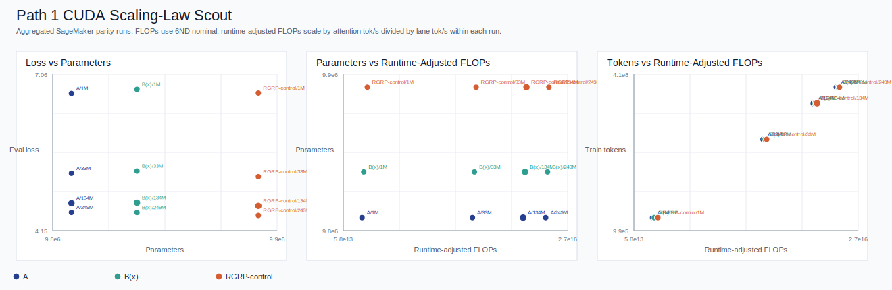

# Path 1 CUDA Scaling-Law Scout

This artifact aggregates completed SageMaker Path 1 CUDA parity summaries into scaling-law inputs.

## Aggregate Points

| Lane | d_model | Tokens | Seeds | Mean Loss | Loss Stdev | Mean tok/s | Runtime-adjusted FLOPs |
|---|---:|---:|---:|---:|---:|---:|---:|
| `A` | 128 | 1,638,400 | 1 | 6.7034 | 0.0000 | 181,484 | 9.612e+13 |
| `B(x)` | 128 | 1,638,400 | 1 | 6.7803 | 0.0000 | 173,863 | 1.007e+14 |
| `RGRP-control` | 128 | 1,638,400 | 1 | 6.7113 | 0.0000 | 158,591 | 1.111e+14 |
| `A` | 128 | 33,554,432 | 1 | 5.2199 | 0.0000 | 180,897 | 1.969e+15 |
| `B(x)` | 128 | 33,554,432 | 1 | 5.2615 | 0.0000 | 171,663 | 2.082e+15 |
| `RGRP-control` | 128 | 33,554,432 | 1 | 5.1576 | 0.0000 | 164,886 | 2.181e+15 |
| `A` | 128 | 134,217,728 | 2 | 4.6640 | 0.0019 | 179,736 | 7.874e+15 |
| `B(x)` | 128 | 134,217,728 | 2 | 4.6736 | 0.0066 | 171,009 | 8.305e+15 |
| `RGRP-control` | 128 | 134,217,728 | 2 | 4.6131 | 0.0020 | 165,313 | 8.645e+15 |
| `A` | 128 | 249,020,416 | 1 | 4.4905 | 0.0000 | 181,594 | 1.461e+16 |
| `B(x)` | 128 | 249,020,416 | 1 | 4.4894 | 0.0000 | 173,257 | 1.537e+16 |
| `RGRP-control` | 128 | 249,020,416 | 1 | 4.4346 | 0.0000 | 167,828 | 1.596e+16 |

## Interpretation Rules

- `Loss vs Parameters` currently shows architecture offsets at nearly fixed parameter count; it is not yet a full parameter scaling law.
- `Runtime-adjusted FLOPs` is a practical proxy until we add exact per-architecture FLOP accounting.
- New model-size rungs should add points horizontally in the parameter plot; longer token rungs should add points upward/rightward in the tokens-vs-compute plot.

## Source Runs

| Run | Seed | Lane | Tokens | Loss | tok/s |
|---|---:|---|---:|---:|---:|
| `fractal-path1-cuda-parity-scout-20260422T013908Z` | 42 | `A` | 1,638,400 | 6.7034 | 181,484 |
| `fractal-path1-cuda-parity-scout-20260422T013908Z` | 42 | `B(x)` | 1,638,400 | 6.7803 | 173,863 |
| `fractal-path1-cuda-parity-scout-20260422T013908Z` | 42 | `RGRP-control` | 1,638,400 | 6.7113 | 158,591 |
| `fractal-path1-cuda-parity-2048-20260422T020724Z` | 42 | `A` | 33,554,432 | 5.2199 | 180,897 |
| `fractal-path1-cuda-parity-2048-20260422T020724Z` | 42 | `B(x)` | 33,554,432 | 5.2615 | 171,663 |
| `fractal-path1-cuda-parity-2048-20260422T020724Z` | 42 | `RGRP-control` | 33,554,432 | 5.1576 | 164,886 |
| `fractal-path1-cuda-parity-8192-20260422T023232Z` | 42 | `A` | 134,217,728 | 4.6627 | 179,089 |
| `fractal-path1-cuda-parity-8192-20260422T023232Z` | 42 | `B(x)` | 134,217,728 | 4.6689 | 169,919 |
| `fractal-path1-cuda-parity-8192-20260422T023232Z` | 42 | `RGRP-control` | 134,217,728 | 4.6144 | 164,471 |
| `fractal-path1-cuda-parity-8192-s43-20260422T033815Z` | 43 | `A` | 134,217,728 | 4.6653 | 180,384 |
| `fractal-path1-cuda-parity-8192-s43-20260422T033815Z` | 43 | `B(x)` | 134,217,728 | 4.6783 | 172,099 |
| `fractal-path1-cuda-parity-8192-s43-20260422T033815Z` | 43 | `RGRP-control` | 134,217,728 | 4.6117 | 166,155 |
| `fractal-path1-cuda-parity-15199-s42-20260422T042837Z` | 42 | `A` | 249,020,416 | 4.4905 | 181,594 |
| `fractal-path1-cuda-parity-15199-s42-20260422T042837Z` | 42 | `B(x)` | 249,020,416 | 4.4894 | 173,257 |
| `fractal-path1-cuda-parity-15199-s42-20260422T042837Z` | 42 | `RGRP-control` | 249,020,416 | 4.4346 | 167,828 |
